# Neuro-Symbolic Highway Driving Agent

A comparative study of three approaches to autonomous highway driving in the [highway-env](https://highway-env.farama.org/) simulator: a pure neural RL agent, a pure symbolic rule-based agent, and a neuro-symbolic agent that combines learned behavior with formal safety guarantees.

---

## Table of Contents

- [Neuro-Symbolic Highway Driving Agent](#neuro-symbolic-highway-driving-agent)
  - [Table of Contents](#table-of-contents)
  - [Task Description](#task-description)
    - [Reward Function](#reward-function)
  - [Approaches](#approaches)
    - [Approach 1: Pure Neural (Pearl DQN)](#approach-1-pure-neural-pearl-dqn)
      - [DeepSet Q-Network](#deepset-q-network)
      - [Double DQN with Prioritized Experience Replay (PER)](#double-dqn-with-prioritized-experience-replay-per)
      - [Key Hyperparameters](#key-hyperparameters)
    - [Approach 2: Pure Symbolic (FSM)](#approach-2-pure-symbolic-fsm)
      - [States and Transitions](#states-and-transitions)
      - [Safety Margins](#safety-margins)
    - [Approach 3: Neuro-Symbolic (Shielded Pearl DQN)](#approach-3-neuro-symbolic-shielded-pearl-dqn)
      - [LTL Safety Constraints](#ltl-safety-constraints)
      - [Action Masking at Environment Level](#action-masking-at-environment-level)
      - [Pearl SafetyModule](#pearl-safetymodule)
      - [Override Penalty](#override-penalty)
  - [Experiments](#experiments)
  - [Results](#results)
    - [All episodes (n = 100 per agent)](#all-episodes-n--100-per-agent)
    - [Excluding spawn-induced early crashes](#excluding-spawn-induced-early-crashes)
  - [Limitations](#limitations)
  - [Conclusion](#conclusion)
  - [Setup \& Usage](#setup--usage)
    - [Installation](#installation)
    - [Train](#train)
    - [Evaluate](#evaluate)
    - [Visualize](#visualize)
    - [Test](#test)
    - [Project Structure](#project-structure)
  - [References](#references)

---

## Task Description

The agent controls an ego vehicle on a 4-lane highway populated with 50 other vehicles. At each time-step the agent receives a kinematic observation of the 10 nearest vehicles — sorted by longitudinal distance — with 5 features each (presence, $x$, $y$, $v_x$, $v_y$, normalized and ego-relative) and must select one of five meta-actions:

| Action ID | Action |
|-----------|--------|
| 0 | `LANE_LEFT` |
| 1 | `IDLE` |
| 2 | `LANE_RIGHT` |
| 3 | `FASTER` |
| 4 | `SLOWER` |

### Reward Function

The per-step reward has three weighted components, normalized to $[0, 1]$:

$$r_{\text{raw}} = 0.4 \cdot r_{\text{speed}} + 0.1 \cdot r_{\text{lane}} - 1.0 \cdot \mathbf{1}[\text{crash}]$$

$$r = \frac{r_{\text{raw}} + 1}{1.5} \cdot \mathbf{1}[\text{on road}]$$

where

$$r_{\text{speed}} = \mathrm{clip}\!\left(\frac{v - 20}{10},\, 0,\, 1\right), \qquad r_{\text{lane}} = \frac{k}{K - 1}$$

$v$ is forward speed in m/s, $k$ is the lane index from the left, and $K = 4$ is the total lane count. A crash or going off-road zeroes the reward and terminates the episode.

**Core challenge:** although highway-env sorts the observation by distance, the sort order changes every time-step as vehicles overtake or are overtaken. This dynamic reordering makes fixed-slot MLP representations brittle. Additionally, safety requirements must hold at every time-step regardless of what the policy has learned so far. Balancing high-speed driving with provably safe behavior is the central problem.

---

## Approaches

All three approaches are built on [Pearl](https://github.com/facebookresearch/Pearl) — Meta's modular production-grade reinforcement learning library — and share the same environment configuration and evaluation protocol.

### Approach 1: Pure Neural (Pearl DQN)

**Files:** [deep_set_network.py](deep_set_network.py), [double_dqn_per.py](double_dqn_per.py), [per_replay_buffer.py](per_replay_buffer.py), [pearl_environment.py](pearl_environment.py)

A standalone deep RL agent with no safety enforcement. It serves as the **unconstrained baseline** — pure reward optimization — and quantifies the crash rate that results from reward-only training.

#### DeepSet Q-Network

Although highway-env sorts vehicles by distance, their slot positions shift every time-step as relative distances change. A standard flat MLP assigns separate learned weights to each input slot, so it is sensitive to this reshuffling. A **DeepSet** architecture [1] avoids this by applying a shared encoder to every slot independently, then aggregating:

| Symbol | Role | Architecture |
| ------ | ---- | ----------- |
| $\phi$ (encoder) | per-vehicle MLP | $[5 \to 64 \to 64]$ (shared weights) |
| $\Sigma$ (aggregate) | element-wise sum | over $N$ vehicles |
| $\rho$ (head) | Q-value MLP | $[64 + \lvert\mathcal{A}\rvert \to 256 \to 256 \to 1]$ |

Each vehicle's feature vector is encoded independently through $\phi$, the embeddings are summed (making the representation invariant to slot permutations), and the result is concatenated with an action embedding before the Q-value head $\rho$ produces a scalar value.

#### Double DQN with Prioritized Experience Replay (PER)

Training uses **Double Q-learning** to reduce overestimation: the online network selects the greedy next action while the target network evaluates it.

**Loss:**

$$L = \mathbb{E}\!\left[ w_i \cdot \left(Q(s,a) - \left(r + \gamma \cdot Q_{\text{target}}\!\left(s',\, \arg\max_{a'} Q(s',a')\right)\right)\right)^{\!2} \right]$$

where $w_i$ are importance-sampling (IS) weights that correct for the non-uniform sampling introduced by PER.

**PER hyperparameters:**

| Parameter | Value | Role |
|-----------|-------|------|
| $\alpha$ | 0.6 | Priority exponent — interpolates between uniform (0) and full priority (1) |
| $\beta$ | $0.4 \to 1.0$ | IS exponent — annealed over training to remove bias |
| $\varepsilon$ | 1e-6 | Minimum priority, ensures all transitions are reachable |

Sampling probability and IS weight for transition $i$:

$$P(i) = \frac{p_i^{\,\alpha}}{\displaystyle\sum_j p_j^{\,\alpha}}, \qquad w_i = \left(\frac{1}{N \cdot P(i)}\right)^{\!\beta}$$

After each gradient step the replay buffer priorities are updated with fresh $|\text{TD error}|$ values.

#### Key Hyperparameters

| Parameter | Value |
|-----------|-------|
| Hidden layers | [256, 256] |
| Learning rate | 5e-4 |
| Batch size | 32 |
| Replay buffer capacity | 15,000 |
| Discount $\gamma$ | 0.8 |
| Target update interval | 50 steps |
| Learning starts | 200 steps |
| Total training time-steps | 100,000 |
| $\varepsilon$-greedy schedule | $1.0 \to 0.05$ over first 10k steps |

---

### Approach 2: Pure Symbolic (FSM)

**File:** [symbolic_agent.py](symbolic_agent.py)

A hand-coded finite-state machine (FSM) agent that requires no training. It provides a **safety-aware conservative baseline**: the agent prioritizes collision avoidance over speed, establishing a lower bound on achievable reward under purely rule-based control.

#### States and Transitions

The FSM has four states that govern high-level driving intent:

- **CRUISE** — open road ahead; try to go faster.
- **FOLLOW** — vehicle blocking the current lane; seek an overtake opportunity.
- **OVERTAKE_L** — actively executing a left lane change.
- **KEEP_RIGHT** — done overtaking; return to the right for lane discipline.

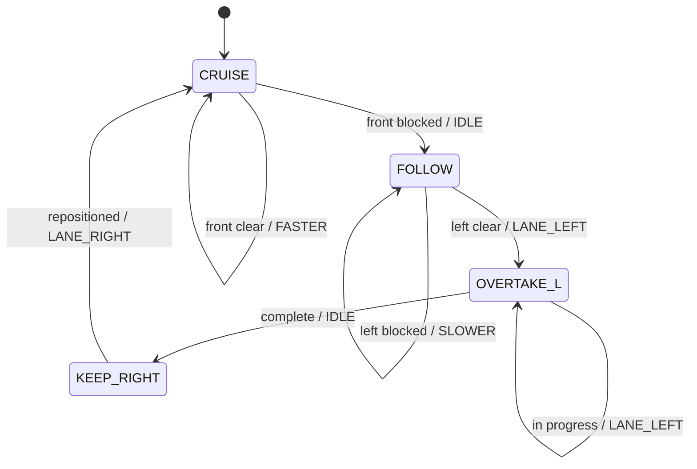

| State | Condition | Action | Next State |
| ----- | --------- | ------ | ---------- |
| `CRUISE` | front clear | `FASTER` | `CRUISE` |
| `CRUISE` | front blocked | `IDLE` | `FOLLOW` |
| `FOLLOW` | left lane clear | `LANE_LEFT` | `OVERTAKE_L` |
| `FOLLOW` | left blocked | `SLOWER` | `FOLLOW` |
| `OVERTAKE_L` | lane change in progress | `LANE_LEFT` | `OVERTAKE_L` |
| `OVERTAKE_L` | lane change complete | `IDLE` | `KEEP_RIGHT` |
| `KEEP_RIGHT` | repositioned | `LANE_RIGHT` | `CRUISE` |

#### Safety Margins

The FSM applies tighter thresholds than the LTL shield (20% added margin) to be conservatively safe:

| Constraint | FSM threshold | Shield threshold |
|------------|--------------|-----------------|
| Front distance | 0.24 | 0.20 |
| Time-to-collision | 2.4 s | 2.0 s |
| Side margin | 0.22 | 0.20 |

The FSM makes no use of the reward signal and has no exploration component. Its performance reflects the ceiling achievable by static rule-based control without learned adaptation.

---

### Approach 3: Neuro-Symbolic (Shielded Pearl DQN)

**Files:** [safety_shield.py](safety_shield.py), [pearl_environment.py](pearl_environment.py), [pearl_safety_module.py](pearl_safety_module.py), [double_dqn_per.py](double_dqn_per.py)

The neuro-symbolic agent combines the Pearl DQN from Approach 1 with a formal **Linear Temporal Logic (LTL) safety shield** [2]. The shield enforces four hard invariants at every time-step, making unsafe actions unavailable to the policy rather than overriding its output post-hoc.

#### LTL Safety Constraints

The shield enforces the following globally-valid ($G$) LTL formulae:

$$
\begin{aligned}
\varphi_1: &\quad G\bigl(d_{\text{front}} > 20\,\text{m}\bigr) & &\text{(no tailgating)} \\
\varphi_2: &\quad G\bigl(\tau_{\text{front}} > 2.0\,\text{s}\bigr) & &\text{(safe time-to-collision)} \\
\varphi_3: &\quad G\bigl(\text{LaneLeft} \Rightarrow \neg\,o_{\text{left}}\bigr) & &\text{(left lane clear before merging)} \\
\varphi_4: &\quad G\bigl(\text{LaneRight} \Rightarrow \neg\,o_{\text{right}}\bigr) & &\text{(right lane clear before merging)}
\end{aligned}
$$

**Predicate implementations:**

- `_phi1_front_distance()` — scans vehicles ahead in the ego lane; triggers if any are within 20 m
- `_phi2_ttc()` — computes closing time for approaching vehicles using relative velocity
- `_phi3_left_clear()` / `_phi4_right_clear()` — check the adjacent lane (identified by $dy \approx \pm 0.04$ normalized) for vehicles within the side margin

If a proposed action violates any active constraint, the shield substitutes a safe fallback following a fixed priority order: `SLOWER > IDLE > LANE_LEFT > LANE_RIGHT`.

#### Action Masking at Environment Level

A critical design decision distinguishes this implementation from a naïve post-hoc override. The shield is integrated as **action masking inside the environment wrapper** (`ShieldedHighwayPearlEnv`), not applied after the agent selects an action.

After each environment step, the wrapper computes the safe action subset for the resulting state and stores it alongside the transition in the replay buffer. This means the Bellman backup target is:

$$r + \gamma \cdot \max_{a' \in \text{safe}(s')}\, Q_{\text{target}}(s', a')$$

where the maximization is restricted to feasible next-state actions. Without this, storing the proposed (unsafe) action while executing the overridden action creates an off-policy error that corrupts the Q-value estimates.

#### Pearl SafetyModule

`LTLShieldSafetyModule` implements Pearl's `SafetyModule` ABC and provides `filter_action(state, action_space) → safe_action_space`. It reshapes the flat state tensor to 2-D (vehicles × features), evaluates $\varphi_1\text{–}\varphi_4$ for each candidate action, and returns only the safe subset. This module and `ShieldedHighwayPearlEnv` share the same shield predicates to guarantee consistency.

#### Override Penalty

To encourage the policy to internalize safety rather than rely on the shield indefinitely, the environment subtracts a small penalty each time an action is filtered:

$$\text{reward} \mathrel{-}= 0.05 \times \frac{n_{\text{restricted}}}{5}$$

The shield's `override_rate` (fraction of steps where it intervened) decreases as training progresses, indicating that the neural policy is learning to avoid unsafe actions proactively.

---

## Experiments

All three agents were evaluated under identical conditions.

**Environment:** `highway-v0` with 4 lanes, 50 surrounding vehicles, 40 s training episodes / 60 s evaluation episodes, initial spacing 2, `offroad_terminal = True`.

**Training:** Neural and Neuro-Symbolic agents trained for 100,000 time-steps using the Pearl RL framework. Checkpoints are saved every 3,000 steps, and the best model is selected by evaluation reward on 5 greedy episodes.

**Evaluation:** 100 episodes per agent, greedy policy (no exploration), identical random seeds across agents.

**Metrics collected per episode:**

- Cumulative reward
- Mean speed (m/s)
- Crash (binary)
- Episode length (steps)

**Visualizations generated** (`results/figures/`):

1. `fig1_training_curves.svg` — Reward and crash rate vs time-step for Neural and Neuro-Symbolic agents
2. `fig2_bar_comparison.svg` — Bar chart comparing all three agents across all metrics (all 100 episodes)
3. `fig3_shield_filter.svg` — Shield filter rate (intervention frequency) over training
4. `fig4_reward_distribution.svg` — Per-episode reward distribution histograms
5. `fig5_bar_comparison_filtered.svg` — Bar chart as in fig2, but excluding spawn-induced early crashes (episodes that crashed within the first 5 steps)

---

## Results

### All episodes (n = 100 per agent)

| Agent | Reward ± Std | Speed (m/s) ± Std | Crash Rate |
|-------|:------------:|:-----------------:|:----------:|
| Pure Neural (Pearl DQN) | **45.73 ± 16.32** | **27.39 ± 1.95** | 27% |
| Pure Symbolic (FSM) | 38.30 ± 14.83 | 22.95 ± 1.80 | 25% |
| **Neuro-Symbolic (Shielded DQN)** | 40.80 ± 11.44 | 23.03 ± 1.32 | **18%** |

*100 episodes per agent, greedy policy.*

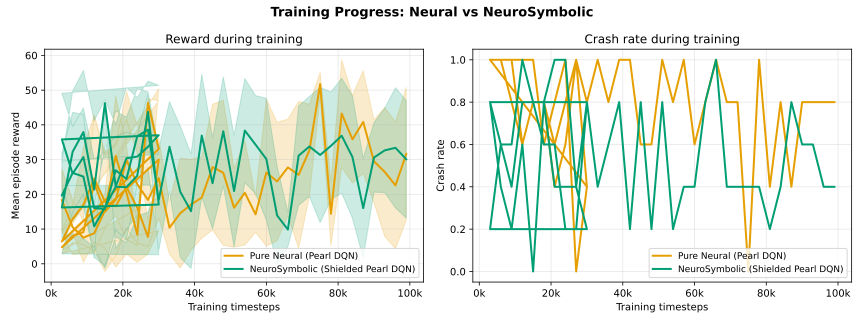

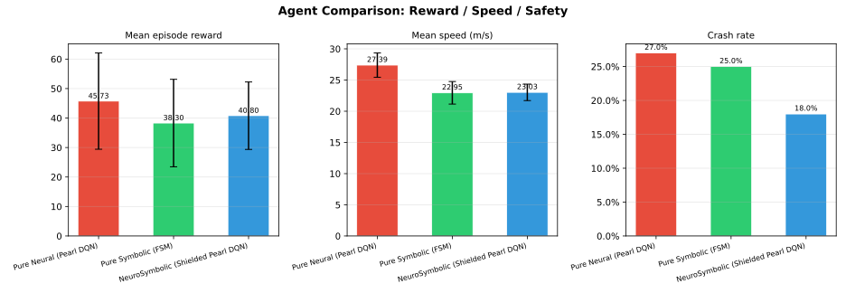

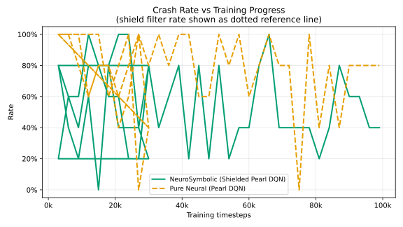

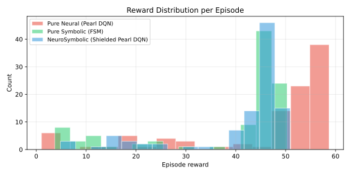

### Excluding spawn-induced early crashes

`highway-env` spawns 50 surrounding vehicles at random positions each episode. Occasionally the ego vehicle is placed in an immediately un-drivable configuration — another vehicle is already overlapping or about to collide regardless of what action the planner takes. These crashes (episodes that terminate within the first 5 steps) reflect environment initialization variance, not planner quality.

The table below filters those episodes out and recomputes statistics over the remaining episodes. The Neuro-Symbolic agent loses no episodes to this filter (its earliest crash occurs at step 8), while Neural loses 5 and Symbolic loses 2.

| Agent | n | Reward ± Std | Speed (m/s) ± Std | Crash Rate |
| ------- | :-: | :------------: | :-----------------: | :----------: |
| Pure Neural (Pearl DQN) | 95 | **48.02 ± 13.26** | **27.53 ± 1.83** | 23.2% |
| Pure Symbolic (FSM) | 98 | 39.00 ± 14.13 | 22.92 ± 1.80 | 23.5% |
| **Neuro-Symbolic (Shielded DQN)** | 100 | 40.80 ± 11.44 | 23.03 ± 1.32 | **18.0%** |

*Episodes where the agent crashed within 5 steps are excluded as spawn-induced.*

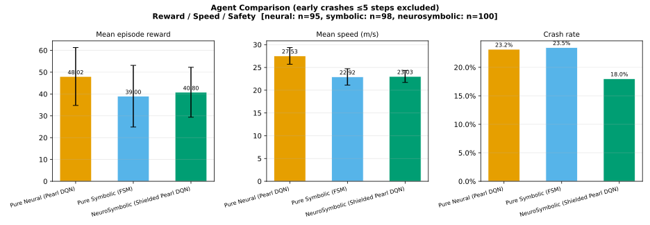

**Key observations:**

1. **Crash rate:** The Neuro-Symbolic agent reduces crashes from 27% to 18% across all 100 episodes — a 1.5× improvement. After filtering spawn crashes, the neural and symbolic agents' crash rates converge almost exactly (23.2% vs 23.5%), revealing that the FSM's apparent safety edge in the full dataset is entirely attributable to the 2 fewer spawn crashes it happened to encounter — not to its conservative rules. The shield is the only intervention that produces a genuine, planner-attributable crash reduction.

2. **Reward stability:** The Neuro-Symbolic agent's reward standard deviation (11.44) is 30% lower than the pure neural agent's (16.32), reflecting the shield cutting the tail of high-penalty crash episodes and producing more consistent lap-to-lap behavior. This gap persists in the filtered dataset (13.26 vs 11.44), confirming it is not an artifact of spawn crashes.

3. **Speed vs safety tradeoff:** The pure neural agent achieves the highest mean reward (45.73 / 48.02 filtered) and speed (27.39 / 27.53 m/s filtered) but at a 27% crash rate. The Neuro-Symbolic agent accepts a ~5–7-point reward penalty in exchange for a 9-percentage-point reduction in planner-attributable crashes — a meaningful safety gain with modest performance cost.

4. **Training dynamics:** The Neuro-Symbolic agent's crash rate descends more smoothly during training. The shield filter rate — initially 15–20% of steps — decreases steadily as the policy internalizes safe behavior, indicating genuine learning rather than perpetual shield dependence.

5. **FSM baseline:** Despite more conservative thresholds than the LTL shield, the FSM achieves the lowest mean reward (38.30) and, once spawn crashes are controlled for, is no safer than the unconstrained neural agent (23.5% vs 23.2%). Hard-coded rules alone cannot anticipate the full diversity of traffic configurations that a learned policy navigates.

### Qualitative Examples

Two episodes per agent — one successful run and one crash (both with > 5 steps, excluding spawn-induced collisions). All GIFs are 2× speed.

#### Pure Neural

**No-crash** — ep-1 (reward 57.79, 60 steps)


**Crash** — ep-27 (reward 35.65, 42 steps)

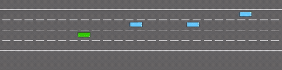

#### Pure Symbolic (FSM)

**No-crash** — ep-7 (reward 50.29, 60 steps)

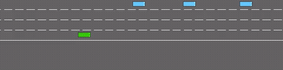

**Crash** — ep-13 (reward 24.96, 30 steps)

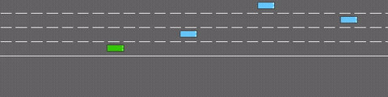

#### Neuro-Symbolic (Shielded DQN)

**No-crash** — ep-10 (reward 48.51, 60 steps)

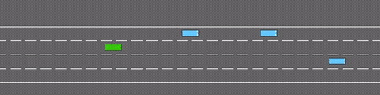

**Crash** — ep-14 (reward 32.36, 44 steps)

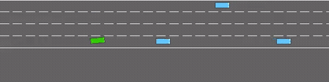

---

## Limitations

- **Partial predicate coverage:** the shield encodes only four safety predicates ($\varphi_1\text{–}\varphi_4$). Crash scenarios arising from cut-ins faster than the TTC threshold, multi-vehicle simultaneous threats, or off-road excursions are not explicitly constrained.

- **Predicate-based approximation:** the shield evaluates simple closed-form conditions rather than a full LTL model checker, so it is LTL-*inspired* rather than a formally verified shield in the theorem-proving sense.

- **Evaluation sample size:** 100 episodes per agent gives reliable crash-rate estimates (±4–5% margin at 95% confidence) but the reward gap between Neural and Neuro-Symbolic (~5 points) has a Cohen's *d* of roughly 0.35 — borderline significant at this sample size. Treat reward rankings as indicative rather than definitive.

- **Single environment type:** all results are specific to the `highway-v0` straight-road scenario. Generalization to ramps, intersections, or roundabouts is untested.

- **Fixed shield thresholds:** the LTL predicates use hand-tuned distance and TTC constants that may not transfer to different speed regimes or vehicle densities without re-tuning.

---

## Conclusion

The results confirm that pure neural RL optimizes for reward at the expense of safety, while pure symbolic rules achieve safety only by excessive conservatism that limits performance. The neuro-symbolic approach resolves this tension: the LTL shield enforces hard safety invariants as inviolable constraints, while the DeepSet DQN learns to maximize reward within the feasible action space.

The key implementation insight is that the shield must be applied at the **environment level as action masking**, not as a post-hoc override. Masking ensures the Bellman backup uses only safe next-state actions, keeping the Q-function estimates on-policy with respect to the shielded behavior. Combined with an override penalty, the policy progressively learns to avoid unsafe states proactively, reducing the shield's intervention rate over training.

Across 100 evaluation episodes, the Neuro-Symbolic agent achieves the lowest crash rate (18% vs 27% for pure neural) and the lowest reward variance (±11.44 vs ±16.32), at a modest reward cost of ~5 points relative to the unconstrained agent. The pure symbolic FSM is the weakest baseline on both reward and safety, confirming that hard-coded rules alone are insufficient. These results demonstrate that formal safety specifications and neural learning are complementary rather than competing.

---

## Setup & Usage

### Installation

```bash
pip install -e .
# Pearl must be installed separately (no PyPI release):
uv pip install "pearl @ git+https://github.com/facebookresearch/Pearl.git" --no-deps
```

### Train

```bash
# Train both agents (100k timesteps each)
python train.py

# Train a single agent
python train.py --agent neural
python train.py --agent neurosymbolic

# Shorter run / resume from checkpoint
python train.py --timesteps 50000
python train.py --resume
```

### Evaluate

```bash
# Compare all three agents over 20 episodes (records MP4s by default)
python evaluate.py

# More episodes or with rendering
python evaluate.py --episodes 30
python evaluate.py --render
python evaluate.py --no-video   # skip MP4 recording
```

### Visualize

```bash
python plot_results.py          # generates figures in results/figures/
```

### Test

```bash
python test.py
```

### Project Structure

```text
project/
├── pyproject.toml             # Package metadata and dependencies
├── config.py                  # Shared hyperparameters and thresholds
├── train.py                   # Training orchestrator
├── train.sl                   # SLURM job script for training
├── evaluate.py                # Evaluation harness
├── evaluate.sl                # SLURM job script for evaluation
├── plot_results.py            # Figure generation
├── test.py                    # Smoke tests
├── deep_set_network.py        # DeepSet Q-network (permutation-invariant)
├── double_dqn_per.py          # Double DQN + PER algorithm
├── per_replay_buffer.py       # Prioritized experience replay buffer
├── symbolic_agent.py          # FSM rule-based agent
├── safety_shield.py           # LTL safety predicates and shield logic
├── pearl_environment.py       # Pearl environment wrappers (plain + shielded)
├── pearl_safety_module.py     # Pearl SafetyModule integration
├── environments.py            # Gymnasium environment factories
├── models/
│   ├── neural/                # Trained neural agent checkpoints
│   │   ├── best_model.pth
│   │   └── model.pth
│   └── neurosymbolic/         # Trained neurosymbolic agent checkpoints
│       ├── best_model.pth
│       └── model.pth
└── results/
    ├── summary.json           # Mean ± std evaluation table (100 episodes)
    ├── comparison.json        # Per-episode evaluation metrics
    ├── neural_train_curve.json
    ├── neurosymbolic_train_curve.json
    ├── figures/               # SVG plots
    │   ├── fig1_training_curves.svg
    │   ├── fig2_bar_comparison.svg
    │   ├── fig3_shield_filter.svg
    │   ├── fig4_reward_distribution.svg
    │   └── fig5_bar_comparison_filtered.svg
    ├── tensorboard/           # TensorBoard training logs
    │   ├── neural/
    │   └── neurosymbolic/
    └── videos/                # Evaluation episode recordings
        ├── neural/
        ├── neurosymbolic/
        └── symbolic/
```

---

## References

[1] Zaheer, M., Kottur, S., Ravanbakhsh, S., Póczos, B., Salakhutdinov, R., & Smola, A. (2017). **Deep Sets.** *Advances in Neural Information Processing Systems (NeurIPS)*, 30.

[2] Alshiekh, M., Bloem, R., Ehlers, R., Könighofer, B., Niekum, S., & Topcu, U. (2018). **Safe Reinforcement Learning via Shielding.** *Proceedings of the AAAI Conference on Artificial Intelligence*, 32(1).

[3] Leurent, E. (2018). **An Environment for Autonomous Driving Decision-Making.** [highway-env](https://github.com/eleurent/highway-env). GitHub.

[4] Zhu, Z., Dong, H., et al. (2023). **Pearl: A Production-Ready Reinforcement Learning Agent.** Meta Research. [GitHub](https://github.com/facebookresearch/Pearl).
